# Library Tracker App

---

## Core Data Model

### Entities

**Member**
- `id`: UUID
- `name`: String
- `email`: String
- `joinedAt`: Date

**Book**
- `id`: UUID
- `title`: String
- `author`: String
- `isbn`: String (optional)
- `addedAt`: Date
- `isAvailable`: Boolean

**Category**
- `id`: UUID
- `name`: String

**Loan**
- `id`: UUID
- `borrowedAt`: Date
- `dueAt`: Date
- `returnedAt`: Date (optional)
- `status`: String (optional)

### Relationships

1. **Category ↔ Book** (1:N, Delete Rule: Nullify)
   - `Category.books` ↔ `Book.category`

2. **Member ↔ Loan** (1:N, Delete Rule: Cascade)
   - `Member.loans` ↔ `Loan.member`

3. **Book ↔ Loan** (1:N, Delete Rule: Cascade)
   - `Book.loans` ↔ `Loan.book`

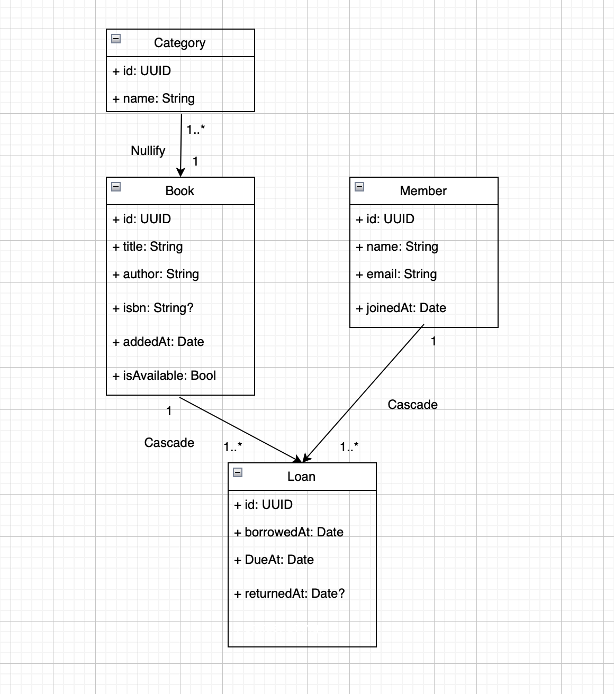

---

## Screenshots

### Books Screen
Browse, search, and filter books by category. Add new books or edit existing ones.

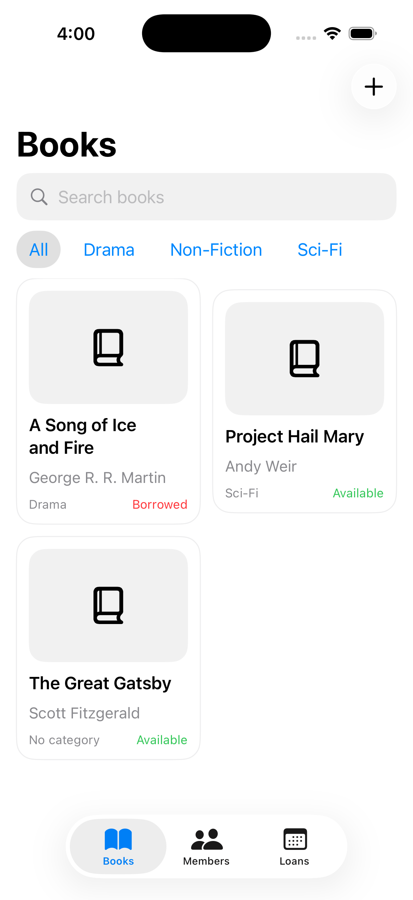

---

### Members Screen
View all library members and their borrowing history.

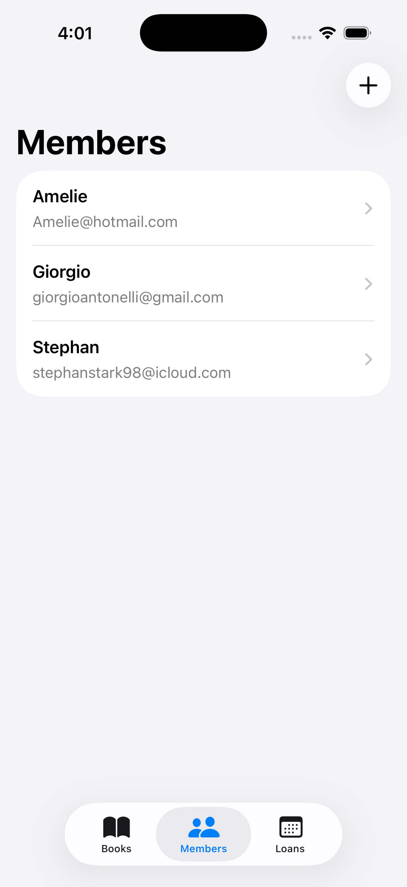

---

### Borrow Screen
Select available books to borrow for a member.

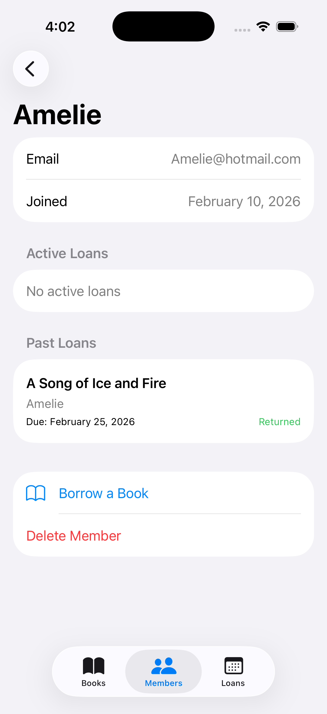

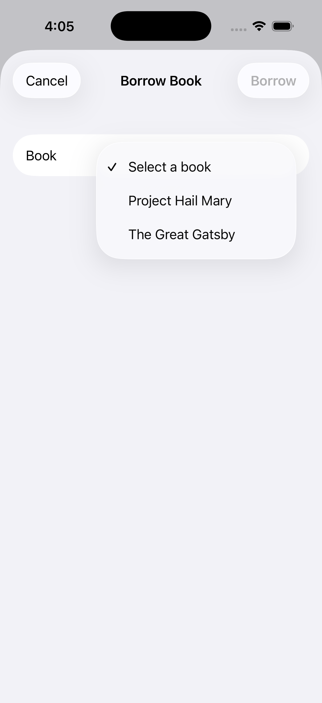

---

### Loans Screen
Track all loans with status indicators (Active, Returned, Overdue).

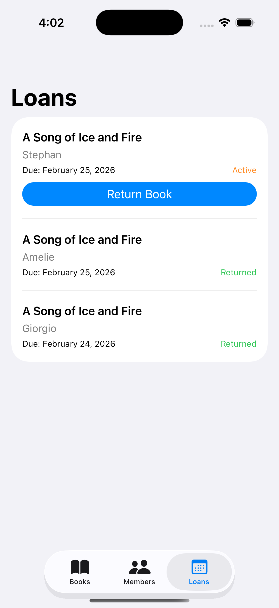

## Core Data Relationship Details

### Category → Book Relationship

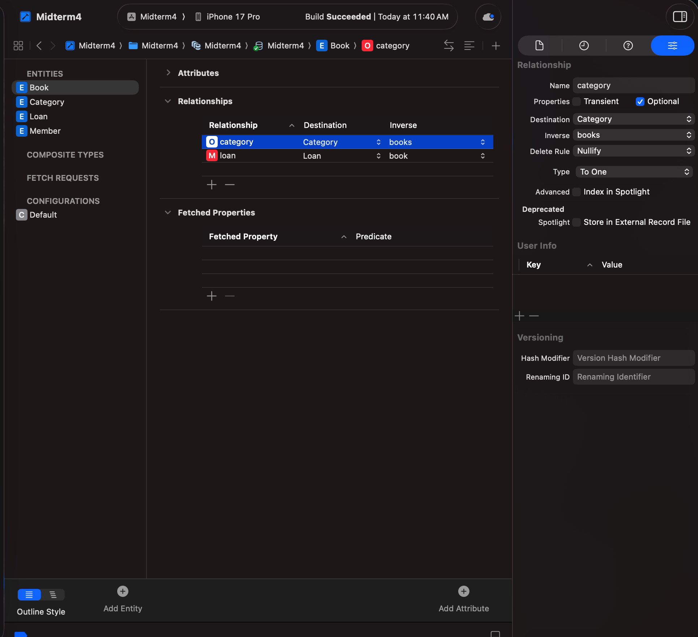

### Member → Loan Relationship
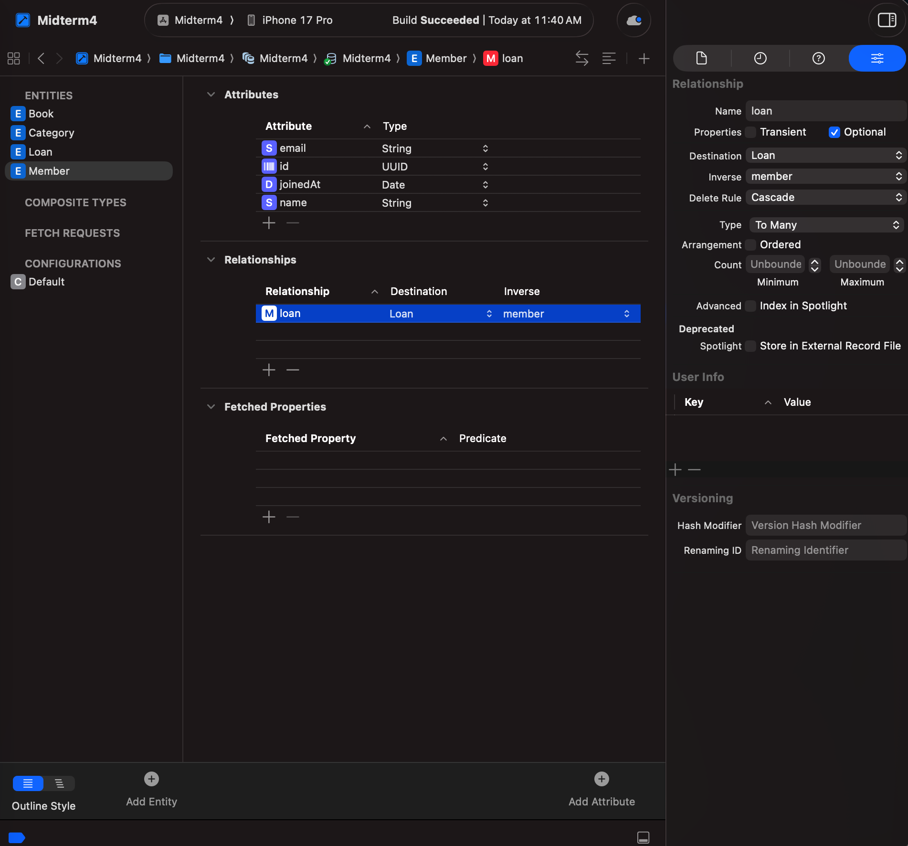
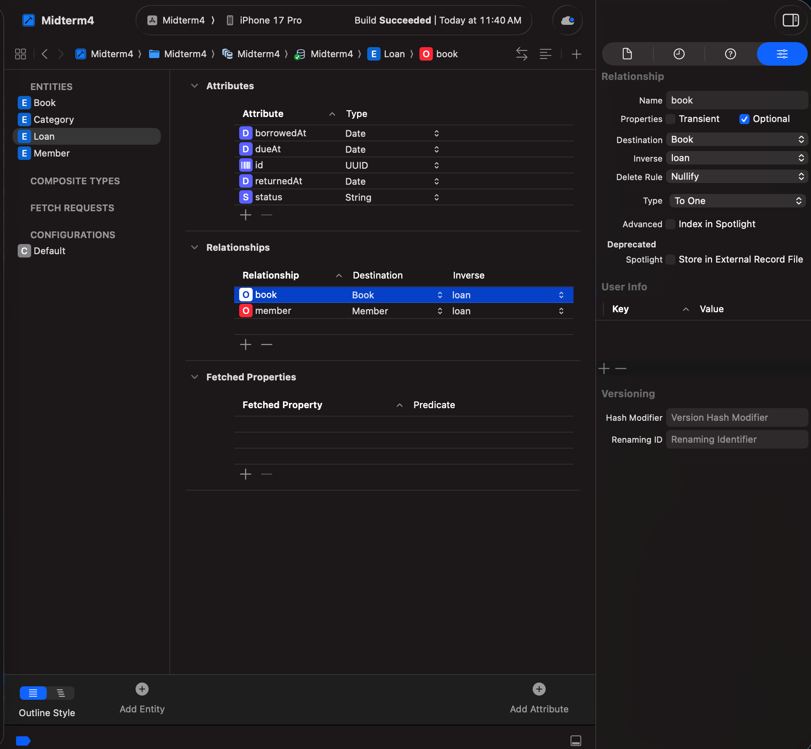

### Book → Loan Relationship
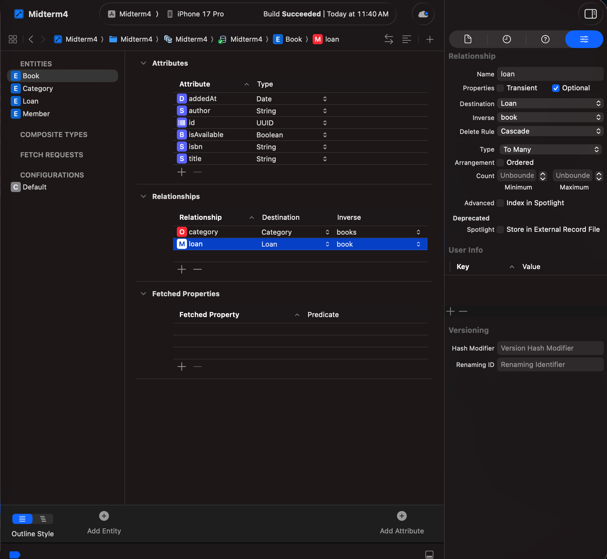
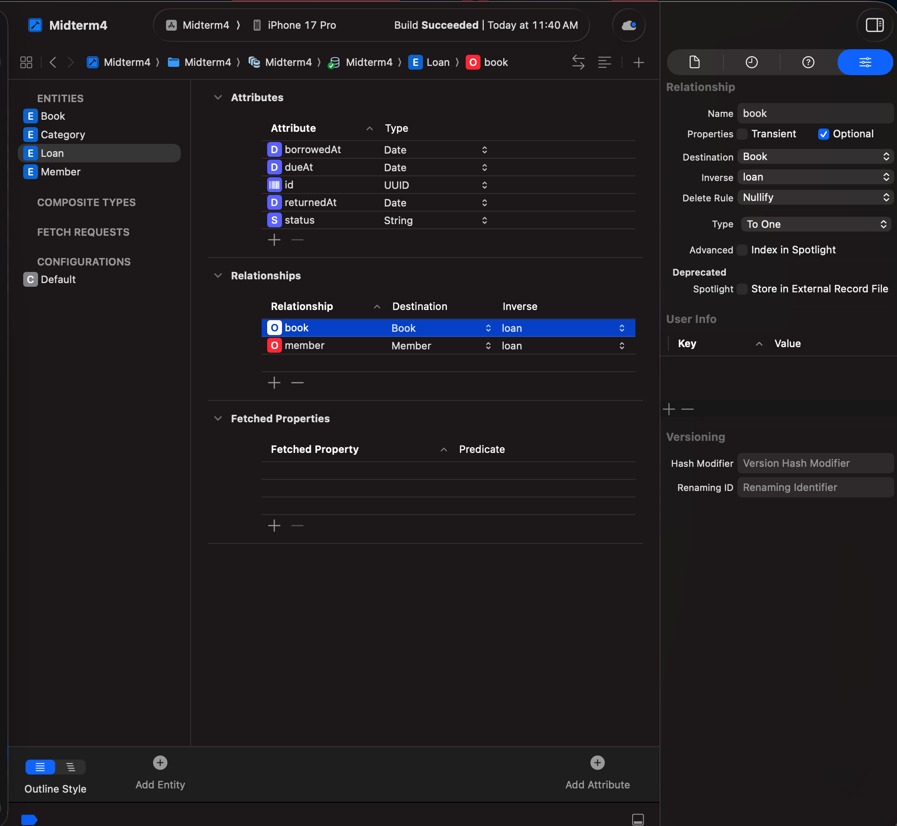

## Author

[Mate Chachkhiani]  

